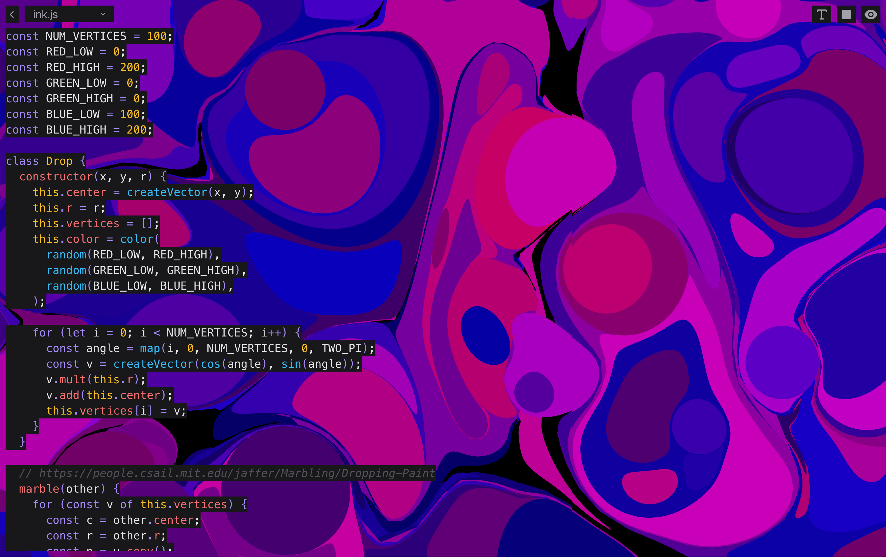

# mvvmm.com

An interactive code editor for live-coding HTML, CSS, JavaScript, Hydra, and
Strudel experiences with real-time iframe previews.



## Stack

- Astro prerenders the gallery and `/editor/[experienceName]` pages.
- React islands preserve the existing editor, controls, and experience context.
- CodeMirror 6 provides editing and syntax highlighting.
- The beta Astro Cloudflare adapter deploys to Workers using the `cf` CLI and
  `cloudflare.config.ts`.
- Workers Builds deploys `main` to production and development branches to Worker
  Previews. The production domain is `mvvmm.com`.

Astro, the Cloudflare adapter, and `cf` use compatible, pinned beta releases.
Update them together and check both production builds and branch previews when
upgrading. This setup uses `astro@7.4.0-beta.1`,
`@astrojs/cloudflare@15.0.0-beta.1`, and `cf@1.0.0-beta.12`.

## Local development

Use Node.js 22.18 or later and the pnpm version pinned in `package.json`.

```sh
nvm use
pnpm install
pnpm run dev
```

Open the URL printed by Astro, normally <http://localhost:6886>.
The beta Astro CLI can run development as a background process; use
`pnpm exec astro dev status`, `pnpm exec astro dev logs`, and
`pnpm exec astro dev stop` to inspect or stop it.

```sh
pnpm run check   # Astro, TypeScript, and React diagnostics
pnpm run build   # cf build in production mode; no upload
pnpm run format  # Format source; experience files are excluded
```

The build writes deployment output to `.cloudflare/output/v0/` and prerendered
pages to `dist/`. Generated output is ignored by Git.

## Deployments

Sign in locally before deploying:

```sh
pnpm exec cf auth login
pnpm run deploy:preview
```

The preview name defaults to the Git branch. Each branch has a stable Preview
URL and each deployment has an immutable Deployment URL. To specify a name:

```sh
pnpm exec cf previews deploy my-preview --mode production
```

Publish production with:

```sh
pnpm run deploy
```

Production publishes the `mvvmm-com` Worker to `mvvmm.com` and `workers.dev`.
`cloudflare.config.ts` excludes the production custom domain when building a
Preview. Previews use `workers.dev` URLs with Cloudflare's noindex header.
The app uses static assets only; sessions and managed image processing are
explicitly disabled, so the adapter does not provision KV or Images bindings.

For unattended deployment, supply `CLOUDFLARE_API_TOKEN` and
`CLOUDFLARE_ACCOUNT_ID` through the CI environment. Never commit token values.

Both deploy commands build for their target. A production build cannot be reused
as a Preview build. To reuse a production build locally:

```sh
pnpm run build
pnpm exec cf deploy --prebuilt --mode production
```

## Workers Builds

The GitHub repository is connected to the `mvvmm-com` Worker. Its Builds settings
use the repository root and the following commands:

| Setting        | Production        | Previews                  |
| -------------- | ----------------- | ------------------------- |
| Branch         | `main`            | Development branches      |
| Build command  | `pnpm run check`  | `pnpm run check`          |
| Deploy command | `pnpm run deploy` | `pnpm run deploy:preview` |

The deploy command handles the framework build, avoiding a duplicate build step.
Pushes to `main` publish production, including the `mvvmm.com` custom domain.
Worker Previews are enabled for branch deployments.
GitHub Actions independently checks types, builds, and deployment output without
Cloudflare credentials; it does not deploy.

## Project structure

- `src/pages/` — gallery, generated editor routes, and the 404 page.
- `src/layouts/` and `src/styles/` — page shell, metadata, favicon, and styling.
- `components/` — React editor, controls, gallery cards, and preview iframe.
- `contexts/` — editor state, preview controls, and Strudel lifecycle.
- `experiences/` — editable HTML, CSS, JavaScript, Hydra, and Strudel sources.
- `data/` — build-time experience loading and iframe document generation.
- `lib/` — CodeMirror themes, editor setup, and audio initialization.

Experience source files are imported as raw text at build time and serialized
into their pages. Add a folder under `experiences/` with a `meta.json`
containing its `createdAt` date (`YYYY-MM-DD`), then rebuild to create its
editor route. The gallery lists experiences newest first. Unknown routes return
the custom 404 page. Browser edits remain in memory and are reset when
navigating away or reloading.

The editor and iframe share one React island with their context and tooltip
providers. Browser-dependent editor and audio code mounts through
`client:only="react"`; the page shell and gallery links are prerendered.

## Graphics experiments

The [experience lab roadmap](docs/experience-lab.md) outlines ten new experiences
and the library integration approach. Try `/editor/garden` for Three.js
and `/editor/tide` for vgpu/WebGPU with a Canvas fallback.

Experience files ending in `.module.js` execute as ES modules. Add a pinned
import map in `scripts.html` to use browser libraries. Relative imports between
editable files are not yet supported. Run `pnpm test` for document-builder checks.

## cf beta preview output workaround

Workers Builds reads preview metadata from `WRANGLER_OUTPUT_FILE_PATH` or
`WRANGLER_OUTPUT_FILE_DIRECTORY`. The pinned cf beta prints its preview result
but does not write that file, which prevents Builds from showing the preview URL
in its GitHub comment. `scripts/cf-previews-deploy.ts`, adapted from the `game`
repository, runs `cf previews deploy` and appends the result in the format Builds
expects. `pnpm run deploy:preview` uses this wrapper locally and in Workers Builds.
These environment variable names are the Builds compatibility protocol; the
wrapper does not invoke Wrangler or use a Wrangler config. Remove it once cf
writes the output metadata itself.
